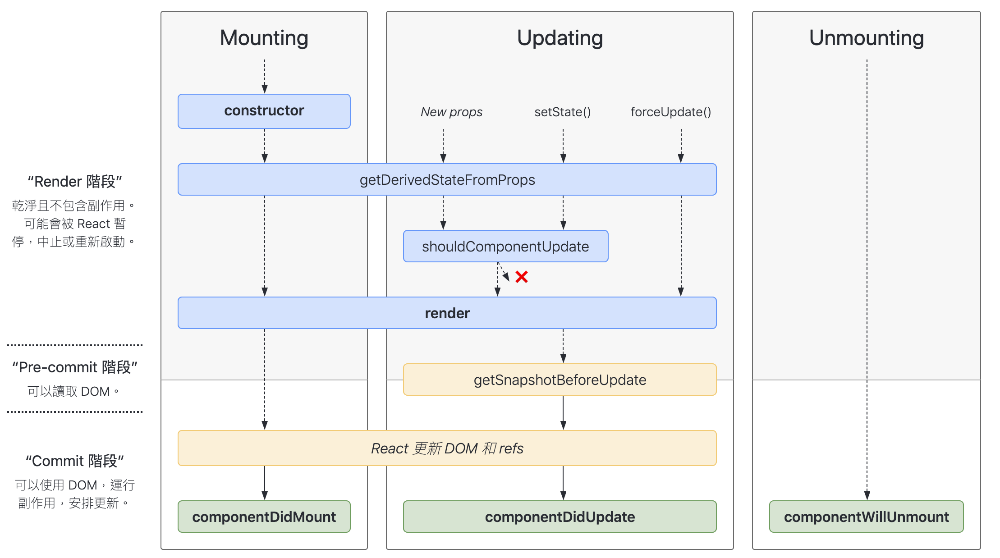

# React-Lifecycle
## 說明
以巢狀 component 的方式演示 React 的生命週期。

Demo: [https://yachen168.github.io/React-Lifecycle/](https://yachen168.github.io/React-Lifecycle/)

圖片來源: [react-lifecycle-methods-diagram](https://projects.wojtekmaj.pl/react-lifecycle-methods-diagram/)

 

## 初始化階段 ReactDOM.render() 
  1. constructor()
  2. UNSAFE_componentWillMount()   👎 (React 17.0)
  3. render() 📌
  4. componentDidMount()   📌

## 更新階段: 
在 component 執行 `this.setState()` 或父組件重新 render 時觸發
  1. shouldComponetUpdate()，若是強制更新(forceUpdate()) 則無
  2. UNSAFE_componetWillUpdate()   👎 (React 17.0)
  3. render()
  4. componentDidUpate()

## 卸載: 
可由 ReactDOM.unmountComponentAtNode() 觸發
  1. componentWillUnmount()   📌

## props 內容更新 
 1. UNSAFE_componentWillReceiveProps()   👎 (React 17.0)

## 生命週期變動
- 新版生命週期(React 17.0)廢棄 3 個 hooks: `componentWillMount`、`componentWillUpdate`、
`componentWillReceiveProps`，須加`UNSAFE_`，否則會出現警告

- 新版生命週期比舊版的新增 2 個 hooks，幾乎用不到:
`getDerivedStateFromProps`、`getSnapshotBeforeUpdate`

註:

1. `UNSAFE_＊` => 表示在未來的 React 版本中可能會出現 bug，可能將被廢棄，應盡量避免使用它們，[參考文件](https://reactjs.org/blog/2018/03/27/update-on-async-rendering.html)
  
2. 📌: 常用，👎: 不推薦使用

